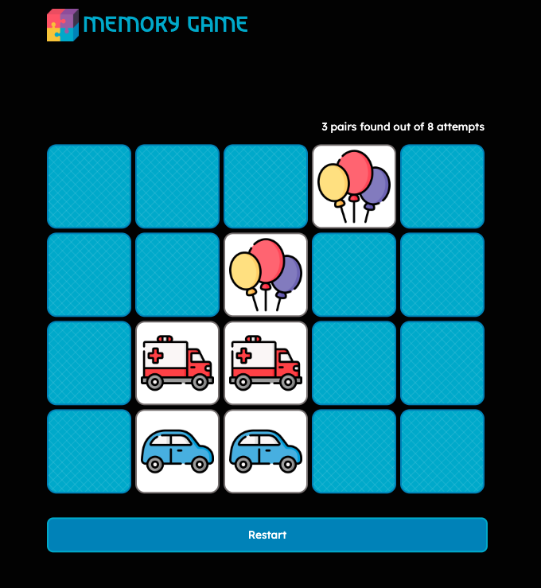

# 🧩 Memory Gamef

<p align="center">
  
</p>

<p align="center">
  <a href="https://jujbraga.github.io/memory-game/">
    
  </a>
</p>

## 💻 About the Project

This is an interactive and responsive **Memory Game**. Developed with a focus on clean logic and smooth user experience, the game challenges players to find matching pairs while tracking their performance.

The project was built using pure **HTML, CSS, and Vanilla JavaScript**, demonstrating DOM manipulation, state management, and CSS Grid/Flexbox layouts.

---

## ✨ Features

- **Difficulty Levels:** Choose your challenge level before starting.
- **Dynamic Board:** Cards are shuffled randomly at the start of every game.
- **Attempt Counter:** Keep track of how many moves you've made to find all pairs.
- **Interactive UI:** Smooth flip animations and visual feedback for matches/mismatches.
- **European Theme:** Educational and fun, featuring various European flags.

---

## 🛠️ Technologies Used

The project was developed using the following technologies:

- **HTML5:** Semantic structure for the game board and controls.
- **CSS3:** Custom styling, responsive design, and CSS transitions for the card animations.
- **JavaScript (ES6+):** Game logic, shuffling algorithms, event listeners, and score tracking.


---

## 🎮 How to Play

1. Select your preferred Difficulty Level.
2. Click on a card to reveal the flag.
3. Click on a second card to find its pair.
4. If the flags match, they stay face up!
5. If they don't match, they will flip back after a short delay.
6. The game ends when all pairs are found. Try to do it in the fewest attempts possible!

---

## 🚀 How to Run the Project

1. **Clone the repository:**
   ```bash
   git clone [https://github.com/Jujbraga/memory-game.git](https://github.com/Jujbraga/memory-game.git)

2. **Navigate to the project folder:**
    ```bash
    cd memory-game
    ```

3. **Open the game:** Simply open the index.html file in your preferred web browser.

<p align="center"> Developed with ❤️ by <a href="https://www.google.com/search?q=https://github.com/Jujbraga">Juliana Braga</a> </p>
